<div align="center">

# 💳 Credit Risk MLOps Pipeline

### Sistema completo de Machine Learning para análise de risco de crédito com foco em impacto financeiro, MLOps, Engenharia de Dados e Inteligência Artificial.

<br>


<br>


</div>

---

# 🚀 Sobre o Projeto

Este projeto representa a construção de uma **plataforma completa de Machine Learning voltada para análise de risco de crédito**, desenvolvida seguindo princípios modernos de:

- Engenharia de Dados
- Ciência de Dados
- Machine Learning
- MLOps
- Engenharia de Software
- APIs
- Testes Automatizados
- Observabilidade
- Reprodutibilidade

Ao invés de simplesmente treinar um modelo de Machine Learning, este projeto demonstra **como um modelo é desenvolvido, validado, versionado, disponibilizado em produção, monitorado e mantido ao longo de todo seu ciclo de vida.**

Em outras palavras:

> **Não é apenas um modelo. É uma plataforma completa de Inteligência Artificial pronta para produção.**

---

# 🎯 Objetivo

O objetivo é desenvolver um sistema capaz de auxiliar instituições financeiras durante o processo de concessão de crédito.

Cada cliente possui características financeiras.

O modelo analisa essas características e estima:

> **Qual é a probabilidade daquele cliente se tornar inadimplente?**

A partir dessa probabilidade, o sistema auxilia na tomada de decisão:

✅ Aprovar

ou

❌ Rejeitar

uma solicitação de crédito.

---

# 💰 O diferencial

A maioria dos projetos de Machine Learning busca melhorar métricas como:

- Accuracy
- Precision
- Recall
- F1 Score

Embora importantes, essas métricas **não representam dinheiro.**

Neste projeto o foco principal é outro:

> **Maximizar lucro financeiro.**

Isso significa que toda decisão do modelo considera o impacto econômico para a empresa.

Por exemplo:

| Situação | Impacto Financeiro |
|------------|------------------:|
| Aprovar um bom cliente | + R$ 1.000 |
| Aprovar um cliente inadimplente | - R$ 10.000 |

Perceba que um único erro pode custar dez vezes mais que um acerto gera de lucro.

Por isso o projeto utiliza uma estratégia chamada:

## Business Driven Machine Learning

ou seja,

> O modelo aprende pensando no negócio, e não apenas em métricas estatísticas.

---

# 📈 Resultado Obtido

Após diversos experimentos e otimizações, o pipeline atingiu aproximadamente:

| Métrica | Resultado |
|---------|----------:|
| AUC ROC | ~0.75 |
| Recall | ~64% |
| Precision | ~17% |
| Pipeline Automatizado | ✅ |
| API REST | ✅ |
| Explainability (SHAP) | ✅ |
| Monitoramento | ✅ |
| Versionamento de Dados | ✅ |
| Versionamento de Modelos | ✅ |
| Testes Automatizados | **140 testes passando** |

Além disso, utilizando otimização baseada em custo financeiro, o projeto alcançou um ganho estimado superior a:

# 💲 +23 Milhões

em retorno financeiro estimado quando comparado a estratégias tradicionais de aprovação.

---

# 🏗️ O que este projeto demonstra

Este projeto foi desenvolvido para demonstrar domínio prático das principais competências exigidas em posições de:

- Data Scientist
- Machine Learning Engineer
- Data Engineer
- MLOps Engineer
- AI Engineer

Durante seu desenvolvimento foram aplicados conceitos como:

- Arquitetura em Camadas
- Modularização
- Clean Code
- SOLID
- Testes Automatizados
- APIs REST
- Versionamento de Dados
- Versionamento de Modelos
- Monitoramento
- Explainability
- Pipelines Reproduzíveis
- Configuração por Ambientes
- Engenharia de Features
- Otimização Financeira

---

# 🌎 Visão Geral da Plataforma

```text
                  DADOS BRUTOS

                        │

                        ▼

             Ingestão de Dados (ETL)

                        │

                        ▼

          Limpeza e Tratamento dos Dados

                        │

                        ▼

          Engenharia de Atributos (Features)

                        │

                        ▼

        Treinamento de Múltiplos Modelos

                        │

                        ▼

              Registro no MLflow

                        │

                        ▼

          Otimização Financeira (Threshold)

                        │

                        ▼

             Modelo Campeão (Champion)

                        │

          ┌─────────────┴─────────────┐

          ▼                           ▼

      API REST                  Explainability

          │                           │

          ▼                           ▼

     Predições                 SHAP Values

          │

          ▼

      Monitoramento

          │

          ▼

      Drift Detection

```

---

# 📚 Índice

- [🚀 Sobre o Projeto](#-sobre-o-projeto)
- [🎯 Objetivo](#-objetivo)
- [💰 O diferencial](#-o-diferencial)
- [📈 Resultado Obtido](#-resultado-obtido)
- [🏗️ Arquitetura Completa](#️-arquitetura-completa)
- [📂 Estrutura do Projeto](#-estrutura-do-projeto)
- [⚙️ Pipeline de Dados](#️-pipeline-de-dados)
- [🧠 Machine Learning](#-machine-learning)
- [📊 Engenharia de Dados](#-engenharia-de-dados)
- [🚀 API](#-api)
- [🔬 Explainability](#-explainability)
- [📈 Monitoramento](#-monitoramento)
- [🧪 Testes Automatizados](#-testes-automatizados)
- [🐳 Docker](#-docker)
- [📦 Instalação](#-instalação)
- [▶️ Como Executar](#️-como-executar)
- [🗺️ Roadmap](#️-roadmap)
- [👨‍💻 Autor](#-autor)

---

> **"Machine Learning não termina quando o modelo é treinado. É justamente nesse momento que o verdadeiro trabalho começa."**

---
# 🏗️ Arquitetura Completa

Este projeto foi desenvolvido seguindo uma arquitetura modular inspirada em aplicações reais de Machine Learning utilizadas em produção.

Ao invés de concentrar toda a lógica em um único notebook ou script Python, cada responsabilidade foi isolada em seu próprio módulo.

Essa abordagem oferece diversas vantagens:

- maior organização;
- facilidade para manutenção;
- código reutilizável;
- facilidade para testes;
- escalabilidade;
- preparação para ambientes corporativos.

---

# 🧩 Arquitetura Geral

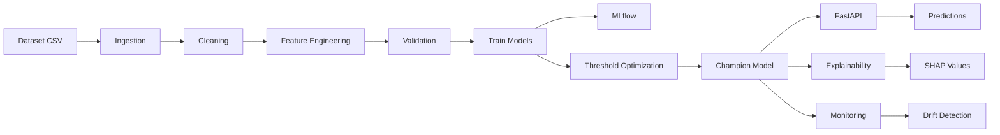

---

# 🏢 Arquitetura em Camadas

O projeto foi dividido em camadas independentes.

Cada camada possui uma única responsabilidade.

```text
┌────────────────────────────────────────────┐
│                 API REST                   │
└────────────────────────────────────────────┘
                    │
                    ▼
┌────────────────────────────────────────────┐
│          Explainability (SHAP)             │
└────────────────────────────────────────────┘
                    │
                    ▼
┌────────────────────────────────────────────┐
│            Machine Learning                │
└────────────────────────────────────────────┘
                    │
                    ▼
┌────────────────────────────────────────────┐
│       Feature Engineering                  │
└────────────────────────────────────────────┘
                    │
                    ▼
┌────────────────────────────────────────────┐
│      Data Cleaning / Processing            │
└────────────────────────────────────────────┘
                    │
                    ▼
┌────────────────────────────────────────────┐
│          Data Ingestion                    │
└────────────────────────────────────────────┘
                    │
                    ▼
┌────────────────────────────────────────────┐
│               Raw Dataset                  │
└────────────────────────────────────────────┘
```

---

# 📂 Organização dos Diretórios

```text
credit-risk-mlops
│
├── data
│   ├── raw
│   ├── processed
│   └── features.parquet
│
├── models
│
├── reports
│   ├── figures
│   └── drift
│
├── docs
│
├── mlruns
│
├── src
│
├── tests
│
├── Dockerfile
├── requirements.txt
├── README.md
└── tasklist.md
```

---

# 🧠 Estrutura da pasta src

Toda a inteligência do projeto está concentrada dentro da pasta **src**.

Cada diretório representa um domínio específico.

```text
src/

├── api/
│
├── config/
│
├── evaluation/
│
├── explainability/
│
├── ingestion/
│
├── modeling/
│
├── monitoring/
│
├── processing/
│
├── validation/
│
└── logger.py
```

---

# 📥 Fluxo da Ingestão

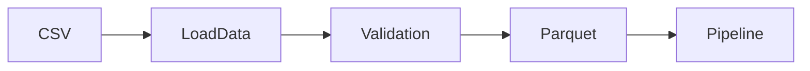

Responsabilidades:

- localizar os arquivos de entrada;
- validar existência;
- converter formatos;
- preparar os dados para o pipeline.

---

# 🧹 Fluxo de Processamento

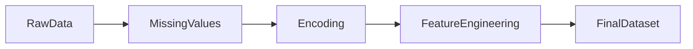

Essa etapa prepara os dados para que os algoritmos consigam aprender corretamente.

Ela inclui:

- limpeza;
- preenchimento de valores ausentes;
- codificação de variáveis categóricas;
- criação de novas features.

---

# 🤖 Fluxo de Machine Learning

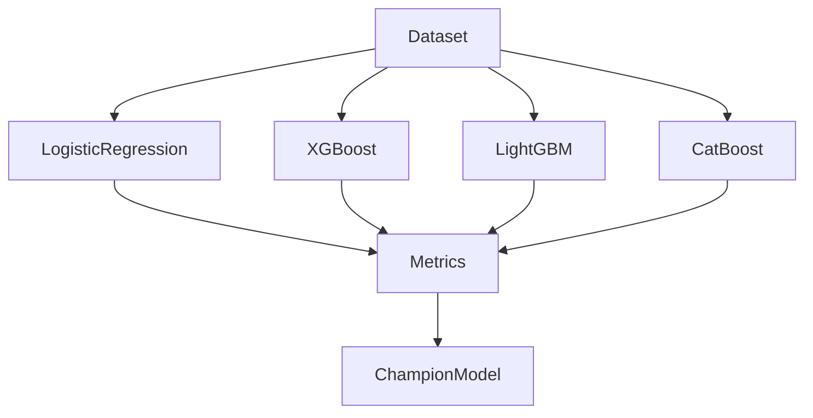

Todos os modelos são treinados exatamente sobre o mesmo conjunto de dados.

Isso garante uma comparação justa.

---

# 📈 Registro dos Experimentos

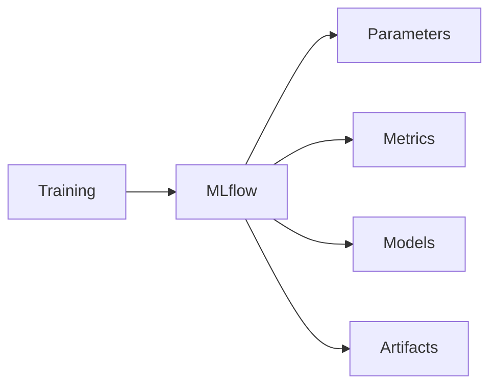

Cada experimento registra automaticamente:

- parâmetros;
- métricas;
- artefatos;
- modelo treinado.

Isso permite reproduzir qualquer treinamento futuramente.

---

# 💰 Otimização Financeira

Após o treinamento, o projeto executa uma etapa exclusiva.

Ao invés de usar o Threshold padrão (0.50), ele procura automaticamente qual Threshold gera maior lucro financeiro.

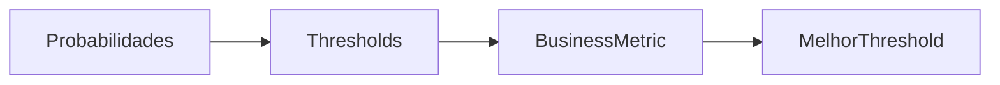

É aqui que o Machine Learning deixa de pensar apenas em estatística e passa a pensar em dinheiro.

---

# 🌐 Arquitetura da API

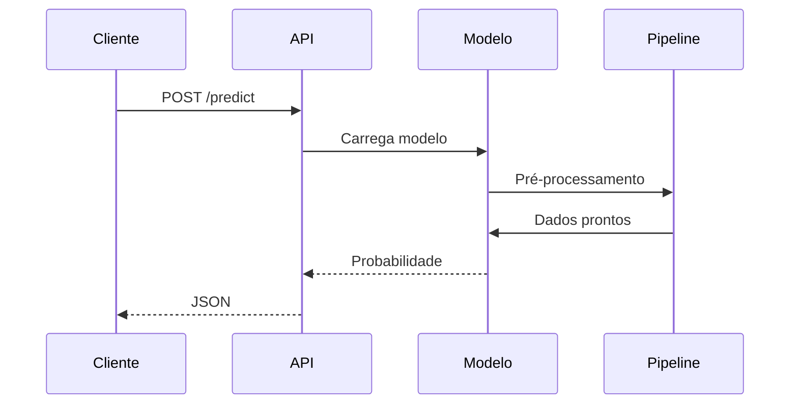

A API foi construída utilizando FastAPI.

Ela é responsável por disponibilizar o modelo para qualquer aplicação.

---

# 🔬 Explainability

Após gerar uma previsão, também é possível explicar por que aquela decisão foi tomada.

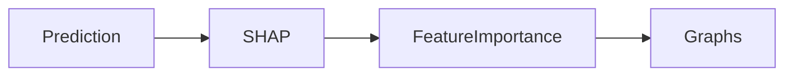

Isso aumenta a confiança no modelo e facilita auditorias.

---

# 📊 Monitoramento

Modelos sofrem degradação com o passar do tempo.

Por isso existe um módulo dedicado para monitoramento.

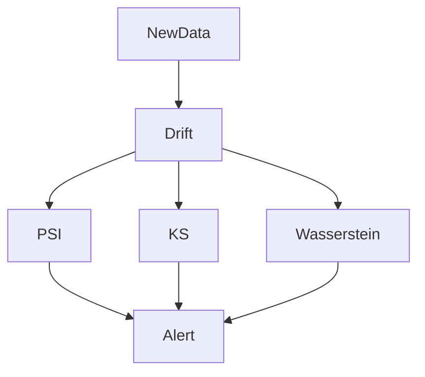

Caso o comportamento dos dados mude significativamente, o sistema identifica automaticamente o problema.

---

# 🧪 Fluxo dos Testes

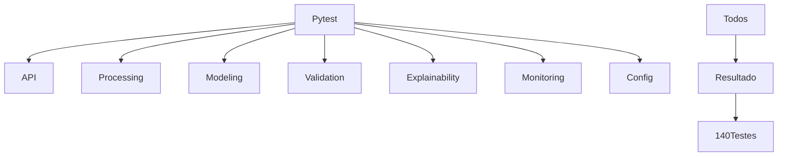

Todo o projeto é protegido por testes automatizados, garantindo estabilidade durante futuras alterações.

---

# 🔄 Fluxo Completo do Projeto

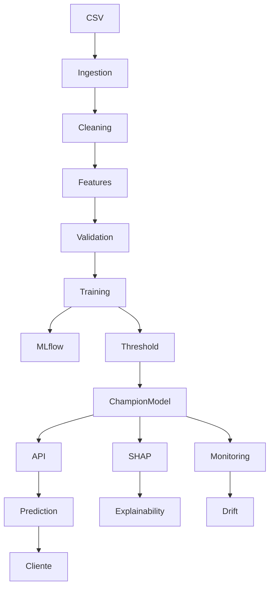

---

# 🎯 Filosofia da Arquitetura

Cada módulo possui uma única responsabilidade.

Essa decisão foi tomada seguindo princípios de Engenharia de Software como:

- Clean Architecture
- SOLID
- Separation of Concerns
- Single Responsibility Principle

O resultado é um projeto organizado, escalável e preparado para receber novas funcionalidades sem necessidade de grandes refatorações.

---

# 🚀 Como Executar o Projeto

## Pré-requisitos

Antes de iniciar, certifique-se de possuir instalado:

| Ferramenta | Versão Recomendada |
|------------|-------------------:|
| Python | 3.14+ |
| Git | Última versão |
| Docker | Opcional |
| DVC | Última versão |
| MLflow | Última versão |

---

# 📥 Clonando o Projeto

```bash
git clone https://github.com/DSEduhpy/credit-risk-mlops.git

cd credit-risk-mlops
```

---

# 📦 Criando Ambiente Virtual

### Windows

```bash
python -m venv .venv

.venv\Scripts\activate
```

### Linux / Mac

```bash
python3 -m venv .venv

source .venv/bin/activate
```

---

# 📚 Instalando Dependências

```bash
pip install -r requirements.txt
```

---

# ⚙️ Configurando Variáveis de Ambiente

O projeto utiliza um arquivo `.env` para definir variáveis de ambiente.

Exemplo:

```env
CREDIT_RISK_ENV=dev
```

Ambientes disponíveis:

- dev
- test
- prod

---

# ▶️ Executando o Pipeline

## Executar Pipeline Completo

```bash
dvc repro
```

---

## Executar apenas o treinamento

```bash
python -m src.modeling.train
```

---

## Executar API

```bash
uvicorn src.api.app:app --reload
```

Acesse:

```
http://localhost:8000/docs
```

para visualizar automaticamente toda a documentação Swagger.

---

# 📊 Executando o MLflow

```bash
mlflow ui
```

Depois acesse

```
http://localhost:5000
```

---

# 🧪 Executando os Testes

Todos os testes:

```bash
pytest
```

Executar apenas testes rápidos:

```bash
pytest -m unit
```

Executar integração:

```bash
pytest -m integration
```

Executar API:

```bash
pytest tests/api
```

---

# ✅ Qualidade de Código

Verificação Ruff

```bash
ruff check .
```

---

Formatação Black

```bash
black .
```

---

Organização de Imports

```bash
isort .
```

---

# 📈 Tecnologias Utilizadas

| Categoria | Tecnologias |
|-----------|-------------|
| Linguagem | Python |
| Machine Learning | Scikit-Learn |
| Gradient Boosting | XGBoost, LightGBM, CatBoost |
| Engenharia de Dados | Pandas, PyArrow |
| API | FastAPI |
| Explainability | SHAP |
| Versionamento | Git |
| Versionamento de Dados | DVC |
| Experiment Tracking | MLflow |
| Testes | Pytest |
| Containers | Docker |
| Visualização | Matplotlib |

---

# 📊 Principais Competências Demonstradas

✔ Engenharia de Dados

✔ Ciência de Dados

✔ Machine Learning

✔ MLOps

✔ Engenharia de Software

✔ APIs REST

✔ Versionamento de Dados

✔ Versionamento de Modelos

✔ Explainable AI

✔ Monitoramento de Modelos

✔ Testes Automatizados

✔ Arquitetura Modular

✔ Configuração por Ambientes

✔ Feature Engineering

✔ Business Driven Machine Learning

✔ Threshold Optimization

✔ Clean Code

✔ SOLID

✔ Documentação Técnica

---

# 🧪 Cobertura do Projeto

Atualmente o projeto possui cobertura sobre praticamente todos os componentes críticos.

## Componentes testados

✅ Configuração

✅ API

✅ Engenharia de Features

✅ Limpeza

✅ Validação

✅ Explainability

✅ Métricas

✅ Métricas Financeiras

✅ Pipeline

✅ Logger

✅ Modelagem

---

## Resultado Atual

```text
140 testes automatizados

140 aprovados

0 falhas
```

---

# 🛣️ Roadmap

## Engenharia

- [x] Estrutura modular
- [x] Configuração por ambiente
- [x] Logger estruturado
- [x] Arquitetura escalável

---

## Dados

- [x] ETL
- [x] Versionamento com DVC
- [x] Feature Engineering
- [x] Data Validation

---

## Machine Learning

- [x] Logistic Regression
- [x] XGBoost
- [x] CatBoost
- [x] LightGBM
- [x] Benchmark entre modelos
- [x] Threshold Financeiro

---

## Explainability

- [x] SHAP
- [x] Feature Importance

---

## API

- [x] FastAPI
- [x] Swagger
- [x] Endpoint de Predição

---

## Monitoramento

- [x] PSI
- [x] KS
- [x] Wasserstein Distance

---

## Testes

- [x] Unitários
- [x] Integração
- [x] API
- [x] Configuração
- [x] Explainability

---

## Próximos Passos

- [ ] Deploy em Cloud (AWS / Azure / GCP)
- [ ] CI/CD com GitHub Actions
- [ ] Registro automático de modelos
- [ ] Dashboard de Monitoramento
- [ ] Pipeline de Inferência em Tempo Real
- [ ] Observabilidade Completa
- [ ] Kubernetes
- [ ] Model Registry em Produção

---

# 🤝 Contribuições

Contribuições são muito bem-vindas.

Caso encontre algum problema ou tenha sugestões de melhoria:

1. Faça um Fork
2. Crie uma Branch
3. Faça suas alterações
4. Envie um Pull Request

---

# 👨‍💻 Autor

## Eduardo de Castro Vieira

**Cientista de Dados | Engenheiro de Dados | Machine Learning | MLOps**

Apaixonado por transformar dados em decisões inteligentes.

Especializado em:

- Machine Learning
- Engenharia de Dados
- Inteligência Artificial
- Python
- SQL
- MLOps
- FastAPI
- MLflow
- DVC

GitHub

> https://github.com/DSEduhpy

LinkedIn

> https://linkedin.com/in/eduardocastrovieira

---

# ⭐ Gostou do projeto?

Se este projeto foi útil para você:

⭐ Deixe uma estrela no repositório.

📢 Compartilhe.

🤝 Conecte-se comigo no LinkedIn.

Isso ajuda bastante no crescimento do projeto e incentiva a criação de novos conteúdos.

---

<div align="center">

# Obrigado pela visita!

### "Machine Learning não é apenas treinar modelos.

### É construir sistemas confiáveis capazes de gerar valor para o negócio."

---

**Desenvolvido por Eduardo de Castro Vieira**

</div>