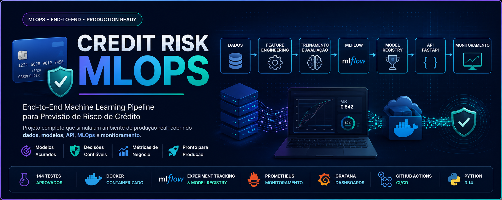

<p align="center">

</p>

# 💳 Credit Risk MLOps

<p align="center">


</p>

---

# 📖 Sobre o Projeto

O **Credit Risk MLOps** é um projeto **End-to-End de Machine Learning e MLOps** desenvolvido para simular um ambiente de produção utilizado por empresas que trabalham com concessão de crédito.

O objetivo é demonstrar todas as etapas do ciclo de vida de um modelo de Machine Learning, desde a ingestão e preparação dos dados até o monitoramento em produção, seguindo boas práticas de Engenharia de Software, Engenharia de Dados e MLOps.

O projeto foi desenvolvido com foco em:

- Arquitetura limpa e modular
- Código escalável
- Reprodutibilidade
- Versionamento de modelos
- Deploy containerizado
- Observabilidade
- Boas práticas de produção

---

# 🚀 Principais Recursos

✅ Pipeline completo de Machine Learning

✅ Engenharia de Features

✅ Benchmark entre múltiplos modelos

✅ Otimização automática de Threshold

✅ Avaliação técnica e financeira

✅ MLflow Tracking

✅ Model Registry (Champion / Challenger)

✅ API REST com FastAPI

✅ Docker & Docker Compose

✅ Monitoramento com Prometheus

✅ Estrutura preparada para Grafana

✅ GitHub Actions (CI/CD)

✅ Código validado com Ruff + Black + Pytest

---

# 📊 Visão Geral

Este projeto simula uma arquitetura utilizada por equipes de Ciência de Dados e Engenharia de Machine Learning em ambientes corporativos.

O pipeline contempla:

```text
Dados
      │
      ▼
Ingestão
      │
      ▼
Validação
      │
      ▼
Processamento
      │
      ▼
Feature Engineering
      │
      ▼
Treinamento
      │
      ▼
Benchmark
      │
      ▼
MLflow
      │
      ▼
Model Registry
      │
      ▼
API FastAPI
      │
      ▼
Docker
      │
      ▼
Monitoramento
```

---

# 🏆 Resultados do Projeto

| Item | Resultado |
|------|-----------|
| Arquitetura Modular | ✅ |
| Pipeline de Treinamento | ✅ |
| API REST | ✅ |
| Docker | ✅ |
| Docker Compose | ✅ |
| MLflow Tracking | ✅ |
| Model Registry | ✅ |
| Champion / Challenger | ✅ |
| Monitoramento | ✅ |
| Prometheus | ✅ |
| GitHub Actions | ✅ |
| Pytest | ✅ 144 testes |
| Ruff | ✅ |
| Black | ✅ |

---

# 🧱 Arquitetura

A arquitetura foi organizada em módulos independentes para facilitar manutenção, testes e evolução do projeto.

```text
                +----------------+
                |   Raw Dataset  |
                +--------+-------+
                         |
                         ▼
                +----------------+
                | Data Ingestion |
                +--------+-------+
                         |
                         ▼
                +----------------+
                | Data Validation|
                +--------+-------+
                         |
                         ▼
                +----------------+
                | Feature Eng.   |
                +--------+-------+
                         |
                         ▼
                +----------------+
                | Model Training |
                +--------+-------+
                         |
                         ▼
                +----------------+
                |   MLflow       |
                +--------+-------+
                         |
                         ▼
                +----------------+
                | Model Registry |
                +--------+-------+
                         |
                         ▼
                +----------------+
                | FastAPI        |
                +--------+-------+
                         |
                         ▼
                +----------------+
                | Docker         |
                +--------+-------+
                         |
                         ▼
                +----------------+
                | Monitoring     |
                +----------------+
```

> Diagramas completos podem ser encontrados em **docs/diagrams/**.

---

# 🎯 Objetivos Técnicos

Este projeto foi desenvolvido para praticar e demonstrar conhecimentos em:

- Machine Learning
- Engenharia de Dados
- Engenharia de Software
- APIs REST
- MLOps
- Docker
- Observabilidade
- Versionamento de Modelos
- Deploy
- Clean Architecture
- Testes Automatizados
- Boas práticas de produção

---

# ⭐ Destaques

O projeto foi estruturado utilizando princípios amplamente adotados na indústria:

- SOLID
- Clean Code
- Modularização
- Baixo acoplamento
- Alta coesão
- Logging estruturado
- Testabilidade
- Reprodutibilidade
- Separação de responsabilidades
- Pipeline desacoplado

---

# 🛠️ Stack Tecnológica

O projeto foi desenvolvido utilizando ferramentas amplamente empregadas em ambientes corporativos.

## Linguagens

- Python 3.14

---

## Machine Learning

- Scikit-Learn
- XGBoost
- LightGBM
- CatBoost

---

## API

- FastAPI
- Uvicorn
- Pydantic

---

## MLOps

- MLflow
- Model Registry (Champion / Challenger)
- Docker
- Docker Compose

---

## Observabilidade

- Prometheus
- Logging Estruturado

> Estrutura preparada para integração com Grafana.

---

## Qualidade de Código

- Pytest
- Ruff
- Black
- Isort

---

## CI/CD

- GitHub Actions

---

## Versionamento

- Git
- GitHub

---

# 📂 Estrutura do Projeto

```text
credit-risk-mlops/

├── .github/
│   └── workflows/
│       ├── docker.yml
│       ├── lint.yml
│       ├── tests.yml
│       └── train.yml
│
├── docs/
│   ├── architecture.md
│   ├── deployment.md
│   ├── tasklist.md
│   └── diagrams/
│
├── requirements/
│
├── src/
│   ├── api/
│   ├── config/
│   ├── evaluation/
│   ├── explainability/
│   ├── ingestion/
│   ├── modeling/
│   ├── monitoring/
│   ├── processing/
│   ├── validation/
│   └── logger.py
│
├── tests/
│
├── Dockerfile
├── docker-compose.yml
├── prometheus.yml
├── README.md
└── pyproject.toml
```

---

# ⚙️ Instalação

## Clone o repositório

```bash
git clone https://github.com/DSEduhpy/credit-risk-mlops.git

cd credit-risk-mlops
```

---

## Crie um ambiente virtual

Windows

```powershell
python -m venv .venv

.venv\Scripts\activate
```

Linux

```bash
python -m venv .venv

source .venv/bin/activate
```

---

## Instale as dependências

```bash
pip install -r requirements/dev.txt
```

---

# ▶️ Executando Localmente

## Executar a API

```bash
uvicorn src.api.app:app --reload
```

A API ficará disponível em:

```
http://localhost:8000
```

---

## Documentação Interativa

Swagger

```
http://localhost:8000/docs
```

ReDoc

```
http://localhost:8000/redoc
```

---

# 🐳 Executando com Docker

Construir a imagem

```bash
docker build -t credit-risk-api .
```

Executar via Docker Compose

```bash
docker compose up
```

A API ficará disponível em

```
http://localhost:8000
```

---

# 📈 MLflow

O projeto utiliza MLflow para rastreamento dos experimentos.

Após iniciar os containers:

```
http://localhost:5000
```

No MLflow são registrados:

- parâmetros
- métricas
- artefatos
- modelos
- histórico dos treinamentos

---

# 🏆 Model Registry

O projeto implementa um Registry simplificado para gerenciamento dos modelos.

Fluxo atual:

```text
Treinamento

↓

Novo Modelo

↓

Registry

↓

Champion

↓

API
```

O Registry oferece suporte para:

- Versionamento
- Champion
- Challenger
- Histórico
- Rollback
- Modelo ativo

---

# 🌐 Endpoints da API

| Método | Endpoint | Descrição |
|---------|----------|-----------|
| GET | `/` | Informações da API |
| GET | `/health` | Health Check |
| GET | `/ready` | Readiness Check |
| GET | `/version` | Versão da aplicação |
| POST | `/predict` | Inferência de risco |

---

# 📊 Fluxo de Predição

```text
Cliente

↓

FastAPI

↓

Modelo Champion

↓

Predição

↓

Resposta JSON
```

---

# 🧪 Testes

O projeto possui testes automatizados para garantir estabilidade durante futuras evoluções.

Executar:

```bash
pytest
```

Resultado atual:

```
144 testes aprovados
```

Também é possível validar toda a qualidade do código:

```bash
ruff check .

black --check .

isort . --check-only
```

Todas as verificações encontram-se aprovadas.---

# 📈 Observabilidade

A aplicação foi preparada para monitoramento contínuo utilizando métricas de infraestrutura e de Machine Learning.

## Recursos implementados

- Logging estruturado
- Monitoramento de inferências
- Monitoramento do modelo Champion
- Detecção de degradação do modelo
- Persistência de métricas
- Alertas de monitoramento
- Health Checks
- Readiness Checks

---

## Prometheus

O projeto disponibiliza métricas compatíveis com Prometheus.

Após iniciar os containers:

```
http://localhost:9090
```

O arquivo de configuração encontra-se em:

```text
prometheus.yml
```

---

## Grafana

A arquitetura foi preparada para integração com Grafana para criação de dashboards operacionais.

Exemplos de métricas monitoráveis:

- Latência da API
- Quantidade de requisições
- Tempo de resposta
- Disponibilidade
- Drift de modelo
- Uso do modelo Champion
- Métricas de negócio

---

# 🔄 CI/CD

O projeto possui pipelines automatizadas utilizando GitHub Actions.

## Workflows

| Workflow | Objetivo |
|-----------|----------|
| tests.yml | Executa toda a suíte de testes |
| lint.yml | Verifica qualidade do código |
| docker.yml | Valida construção da imagem Docker |
| train.yml | Pipeline de treinamento |

Os workflows ficam disponíveis em:

```text
.github/workflows/
```

---

# ☁️ Preparação para Cloud

O projeto foi estruturado visando futura implantação em provedores de nuvem.

A arquitetura foi organizada para facilitar deploy em serviços como:

- AWS
- Azure
- Google Cloud Platform

A documentação de deploy encontra-se em:

```text
docs/deployment.md
```

---

# 📚 Documentação

Toda a documentação técnica está organizada na pasta **docs**.

| Documento | Descrição |
|------------|-----------|
| architecture.md | Arquitetura do sistema |
| deployment.md | Estratégia de deploy |
| tasklist.md | Evolução do projeto |
| diagrams/architecture.mmd | Arquitetura Mermaid |
| diagrams/cicd.mmd | Pipeline CI/CD |

---

# 📌 Roadmap

## ✅ Concluído

- Pipeline completo de treinamento
- Benchmark entre modelos
- Engenharia de Features
- Avaliação financeira
- API FastAPI
- Docker
- Docker Compose
- MLflow Tracking
- Model Registry
- Champion / Challenger
- Monitoramento
- Prometheus
- GitHub Actions
- Logging estruturado
- Testes automatizados
- Arquitetura modular

---

## 🔜 Evoluções futuras

- Deploy em AWS
- Terraform (Infrastructure as Code)
- Kubernetes
- Helm Charts
- Feature Store
- Evidently AI
- Grafana Dashboards completos
- Monitoramento de Drift em produção
- Auto Retraining
- Model Serving escalável

---

# 🤝 Contribuições

Contribuições são bem-vindas.

Caso deseje colaborar:

1. Faça um Fork
2. Crie uma Branch
3. Realize suas alterações
4. Execute toda a suíte de testes
5. Abra um Pull Request

---

# 👨‍💻 Autor

## Eduardo de Castro Vieira

**Data Scientist • Data Engineer • Machine Learning Engineer**

- GitHub: https://github.com/DSEduhpy
- LinkedIn: https://www.linkedin.com/in/eduardo-de-castro-vieira-5b061027b/
- Email: eduardodecastroep@gmail.com

---

# ⭐ Aprendizados

Durante o desenvolvimento deste projeto foram aplicados conceitos de:

- Engenharia de Software
- Engenharia de Dados
- Machine Learning
- MLOps
- APIs REST
- Docker
- MLflow
- Observabilidade
- Testes Automatizados
- Arquitetura Modular
- Clean Code
- SOLID
- CI/CD
- Versionamento de Modelos
- Logging Estruturado
- Deploy

Este projeto representa uma implementação prática de um pipeline completo de Machine Learning inspirado em ambientes de produção, reunindo boas práticas de desenvolvimento, engenharia e operações para criação, disponibilização e monitoramento de modelos preditivos.

---

<p align="center">

⭐ Se este projeto foi útil para você, considere deixar uma estrela no repositório.

</p>
