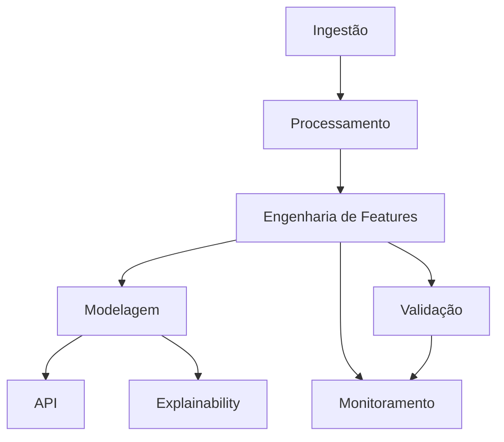
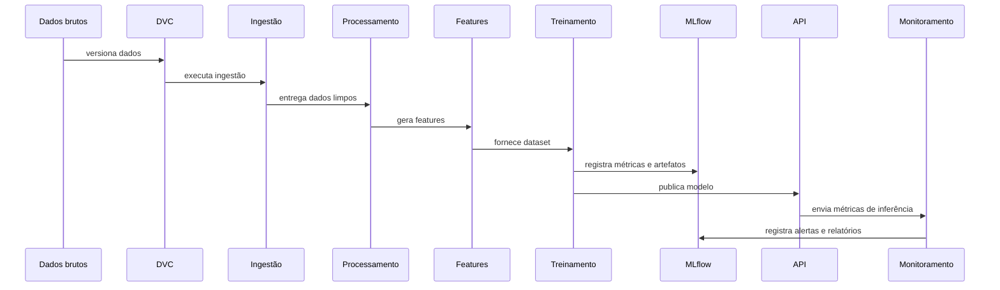
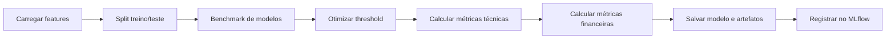
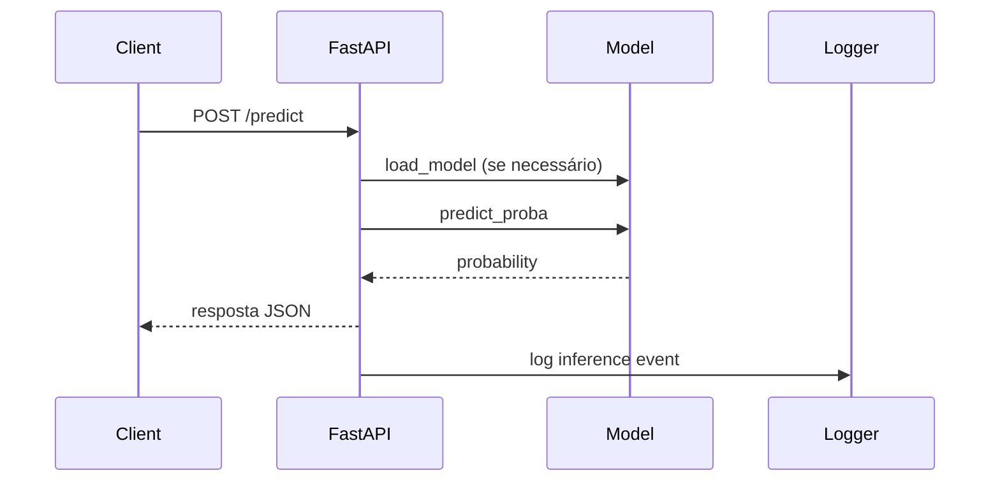
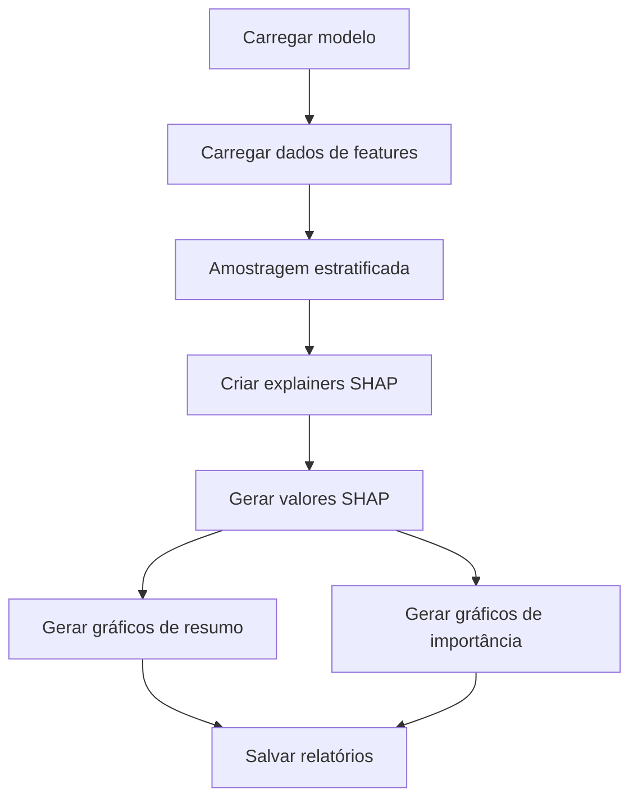
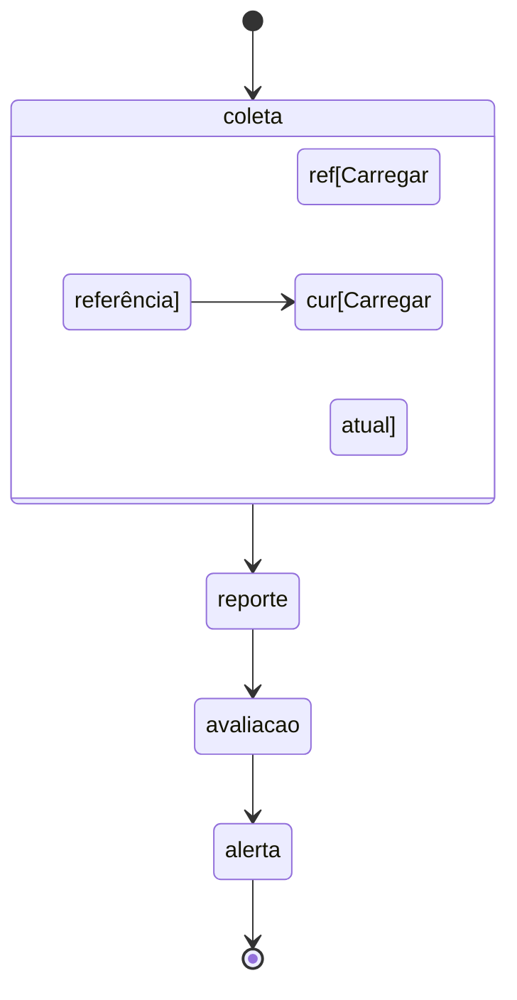
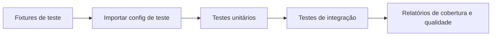
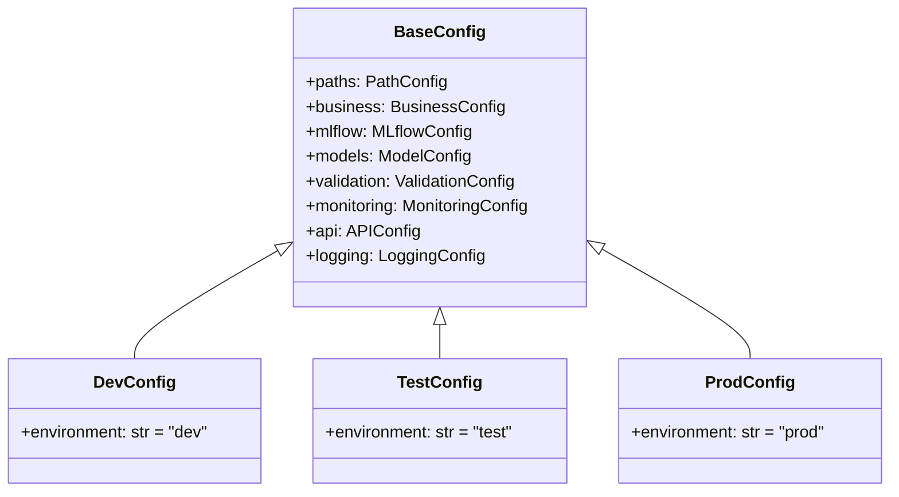
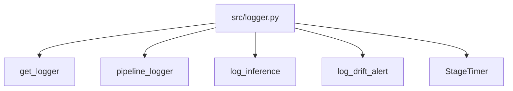
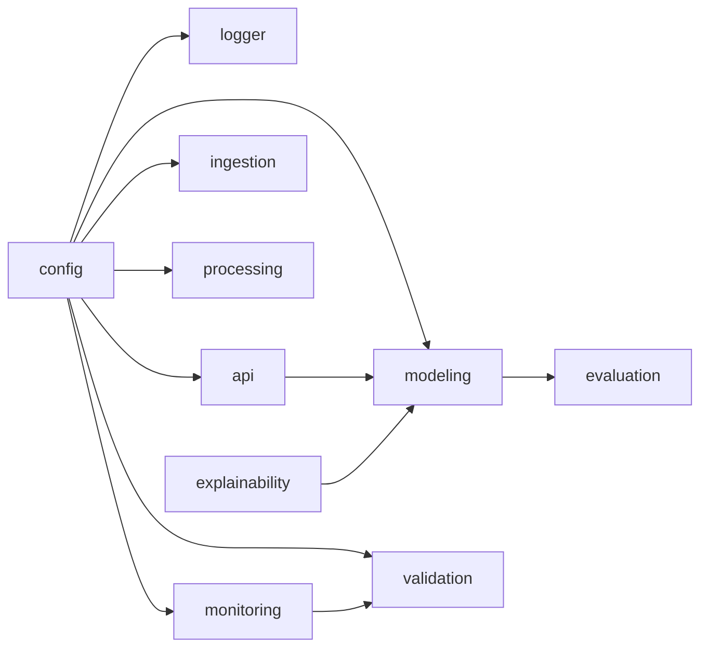

# Arquitetura do Projeto

## 1. Visão Geral

Este projeto adota uma arquitetura modular para um pipeline de risco de crédito baseado em Python. Cada domínio do sistema é isolado em um pacote `src/`, com responsabilidades claras para ingestão, processamento, modelagem, inferência, explicabilidade, validação e monitoramento.

O objetivo da arquitetura é:
- garantir reprodutibilidade com DVC e MLflow
- manter contratos de API estáveis
- suportar deploy via container
- permitir observabilidade e explicabilidade

## 2. Arquitetura

## 3. Fluxo completo do projeto

1. Dados brutos são carregados e versionados por DVC.
2. O pipeline de processamento limpa, transforma e gera features.
3. O treinamento utiliza dados de features e otimiza thresholds de negócio.
4. Modelos e métricas são registrados no MLflow.
5. A API carrega o modelo e serve previsões.
6. Explainability gera explicações SHAP sobre o modelo e os dados.
7. Monitoramento avalia drift e qualidade de dados em produção.

## 4. Fluxo de treinamento

### Detalhes
- O treinamento é realizado em `src/modeling/train.py`.
- O módulo de dados está em `src/modeling/data.py`.
- As funções de `compute_metrics` e `simulate_business_metrics` mantêm o foco em negócio.

## 5. Fluxo da API

### Ponto de entrada
- `src/api/app.py`
- `load_dotenv()` carrega variáveis locais
- O modelo é encontrado em `models/` ou no `mlruns/` local

## 6. Fluxo de Explainability

### Observações
- O módulo de explainability está em `src/explainability/explain.py`.
- A saída é salva em `reports/figures/`.
- O processo é orientado à transparência e a auditoria.

## 7. Fluxo de Monitoramento

### Monitoramento
- `src/monitoring/drift.py` calcula PSI e KS.
- Relatórios são gravados em `reports/drift/`.
- Visualizações são geradas quando as dependências estão disponíveis.

## 8. Fluxo de Testes

### Testes
- Os testes estão em `tests/`.
- `conftest.py` garante `CREDIT_RISK_ENV=test` antes das importações.
- O pipeline de integração valida `clean_data`, `engineer_features` e `modeling`.

## 9. Fluxo das Configurações

### Configuração por ambiente
- `src/config/__init__.py` resolve o ambiente via `CREDIT_RISK_ENV`.
- `dev`, `test` e `prod` definem diferenças em `api`, `mlflow`, `monitoring` e `logging`.

## 10. Fluxo do Logger

### Logger
- O root logger é configurado uma única vez.
- Suporta formato JSON em produção e formato humano em dev/test.
- Handlers de arquivo rotativos são ativados apenas quando `log_to_file=True`.

## 11. Estrutura das pastas

- `data/` — datasets raw, processed e features.
- `docs/` — documentação de arquitetura, projeto e comparações.
- `models/` — modelos serializados.
- `reports/` — relatórios e figuras geradas.
- `src/` — código fonte principal.
- `tests/` — suíte de testes.

## 12. Dependências entre módulos

- `src/config` é dependência central.
- `src/logger` é utilizado por quase todos os domínios.
- `src/modeling` depende de `src/evaluation`.
- `src/api` depende de `src/config` e `src/logger`.

## 13. Implantação e CI

- O projeto agora oferece workflows separados em `.github/workflows/` para lint, testes, build Docker e treinamento.
- O pipeline de validação inclui cache de dependências, Ruff, Black, isort e Pytest.
- O deploy em container é suportado por `Dockerfile` otimizado e `docker-compose.yml` com API, Prometheus e Grafana.
- O Compose cria uma rede isolada com volumes persistentes para modelos, MLruns e logs.
- A API expõe endpoints de health, readiness e métricas para observabilidade inicial.
- A infraestrutura de nuvem real (AWS, ECR, EC2, IAM, Security Groups, Terraform) está preparada como estrutura de referência para implantação futura, com validação real condicionada a credenciais externas.
